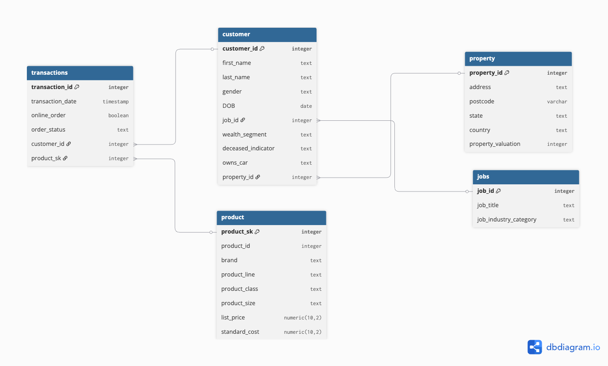

# Создание и нормализация базы данных

**Выполнила**: Смирнова Анастасия

<hr>
 
## 📁 Структура проекта

```text
creating_and_normalazing_db/
├── 📁 sql_sripts/              # SQL-скрипты
│   └── 📄 Смирнова_А.М.sql
├── 📁 Artifacts/               
│   └── 📄 Смирнова А.М.docx    # Документ со скриншотами из DB
├── 📄 README.md                # Документация

```

## Исходная структура

 <hr>

Исходные данные представлены в двух таблицах:

<details>
 
<summary><b>Таблица 'transaction' с полями:</b></summary>

- `transaction_id`- идентификатор транзакции;
- `product_id` - идентификатор товара;
- `customer_id` - индентификатор покупателя;
- `transaction_date` - дата транзакции;
- `online_order` - флаг онлайн заказа (True/ False) ;
- `order_status`- статутс заказа;
- `brand` - бренд продукта;
- `product_line` - линейка товара;
- `product_class` - класс товара;
- `product_size` - размер товара;
- `list_price` - розничная цена товара;
- `standard_cost` - себестоимость товара.
</details>

<details>
 
<summary><b>Таблица 'customer' с полями:</b></summary>

- `customer_id` - идентификатор клиента;
- `first_name` - имя;
- `last_name` - фамилия;
- `gender` - пол;
- `DOB` - дата рождения;
- `job_title` - наименование профессии;
- `job_industry_category` - отрасаль профессии;
- `wealth_segment` - покупательский сегмент;
- `deceased_indicator` - статус активности;
- `owns_car` - владеет автомобилем;
- `address` - адресс;
- `postcode` - почтовый индекс;
- `state` - штат;
- `country` - страна;
- `property_valuation` - оценка объекта недвижимости.
</details>

В качестве первичного ключа можно выделить `transaction_id` для таблицы `transaction` и `customer_id` для таблицы `customer`.

Данные приведены к *первой* нормальной форме: все значения в полях представлены в виде скалярных значений.
Можно сказать, что данные приведены ко *второй* НФ, так как поля в таблицах зависят от первичных ключей.
Однако, данные не находятся в *третьей* НФ, так как прослеживаются транзитивные зависимости.
Например, в таблице `customer` были следующие транзитивные заивисимости:

- `customer_id → job_industry_category → job_title`;
- `customer_id → address → (postcode, state, country, property_valuation)`

В таблице `transaction` следующие:

- `transaction_id → brand → (product_line, product_class, product_size)`.

Для преобразования данных к *третьей* НФ необходимо выделить дополнительные таблицы.
 
 ## Преобразование таблицы `transaction`
 <hr>

Для приведения данных ко *третьей* нормальной форме было принято решение выделить из таблицы `transaction` следующую:

```text

`product` - таблица с информацией о товарах:

├── `product_id`      
├── `brand`                     
├── `product_line`
├── `product_class`
├── `product_size`
├── `list_price`
├── `standard_cost`

```

Было выявлено, что значения в поле `product_id` не являются уникальными, что делает невозможным выбор данного поля в качестве первичного ключа.
Составной ключ с другими полями также оказался невозможен, потому что для некоторых товаров значения во всех полях кроме `list_price` и `product_id` были пустыми.
Было принято решение сгенерировать суррогатный ключ в формате `integer`. Таким образом, был создан дополнительный атрибут - `product_sk`.

В итоге таблице `transaction` приняла следующий вид:

```text

`transaction` - таблица с информацией о покупках:

├── `transaction_id`      
├── `transaction_date`                   
├── `online_order`
├── `order_status`

```

Дополнительно были добавлены атрибуты `product_sk` для связи с таблицей `product`, а также `customer_id` для связи с таблицей `customer`.

 ## Преобразование таблицы `customer`
 <hr>

Было принято решение выделить из таблицы `customer` следующие:

```text

`job` - таблица с информацией о профессиях:

├── `job_title`
├── job_industry_category                
```
Дополнительно был добавлен суррогатный ключ `job_id` для связи с таблицей `customer`.


```text

`property` - таблица с информацией о недвижимости:

├── `address`
├── `postcode`
├── `state`
├── `country`
├── `property_valuation`
               
```
Дополнительно был добавлен суррогатный ключ `propert_id` для связи с таблицей `customer`.

В итоге таблица `cutomer` приняла следующий вид:

```text

`customer` - таблица с информацией о клиентах:

├── `customer_id`
├── `first_name`
├── `last_name`
├── `gender`
├── `DOB`
├── `wealth_segment`
├── `deceased_indicator`
├── `owns_car`

```

Дополнительно были добавлены поля `job_id` для связи с таблицей `job` и `property_id` для связи с таблицей `property`.

 ## Новая схема базы данных
 <hr>

Таким образом, после всех преобразований база данных приняла следующий вид:



Подобная структура базы данных соответствует *третьей* НФ, так как столбцы, которые не являются ключом, зависят только от первичного ключа. Все транзитивные зависимости устранены.

## Загрузка данных в БД

Создание таблиц описано в [SQL-скрипте](https://github.com/steishas/homework1mipt_creating_and_normalazing_db/blob/main/%D0%A1%D0%BC%D0%B8%D1%80%D0%BD%D0%BE%D0%B2%D0%B0_%D0%90%D0%BD%D0%B0%D1%81%D1%82%D0%B0%D1%81%D0%B8%D1%8F.sql).

**NB!** При создании связей между таблицами `customer` и `transcation` возникла ошибка по причине того, что в таблице с транзакциями были данные по транзакциям клиента c идентификатором - 5034, данные по которому отсутствовали в таблице с клиентами.
Для корректной загрузки и связи таблиц было принято решение удалить три записи по транзакциям клиента с данным идентификатором.

Данные были загружены в таблицы через инструмент Import Data в DBeaver. Скриншоты в [документе](https://github.com/steishas/homework1mipt_creating_and_normalazing_db/blob/main/%D0%A1%D0%BC%D0%B8%D1%80%D0%BD%D0%BE%D0%B2%D0%B0_%D0%90%D0%BD%D0%B0%D1%81%D1%82%D0%B0%D1%81%D0%B8%D1%8F.docx).
